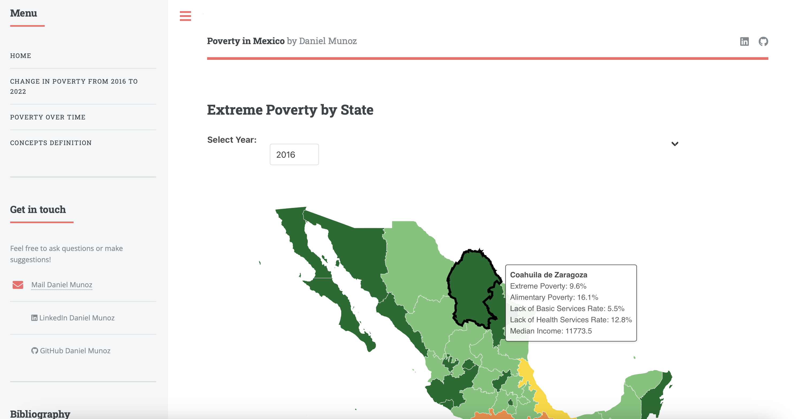
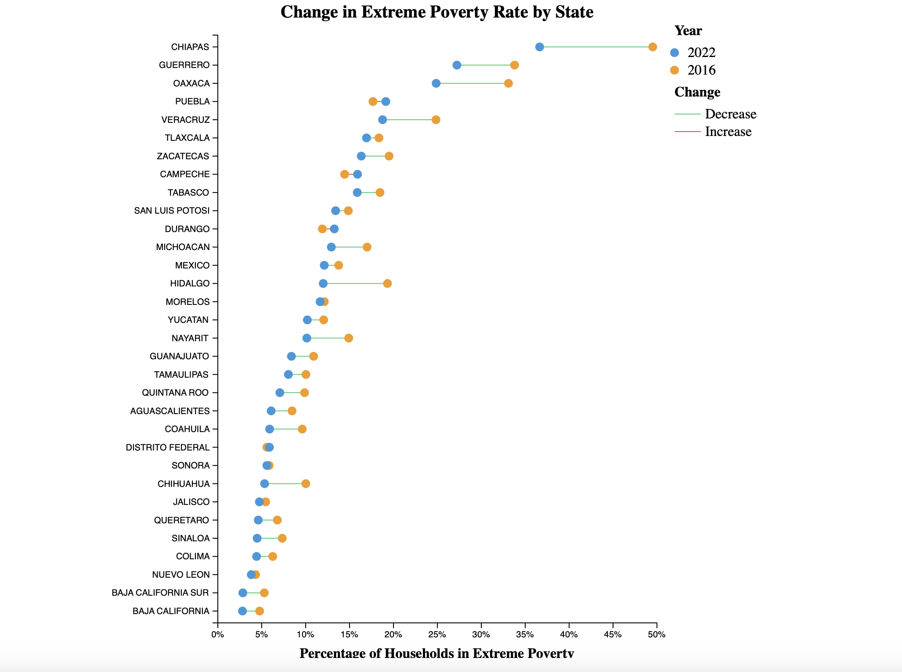
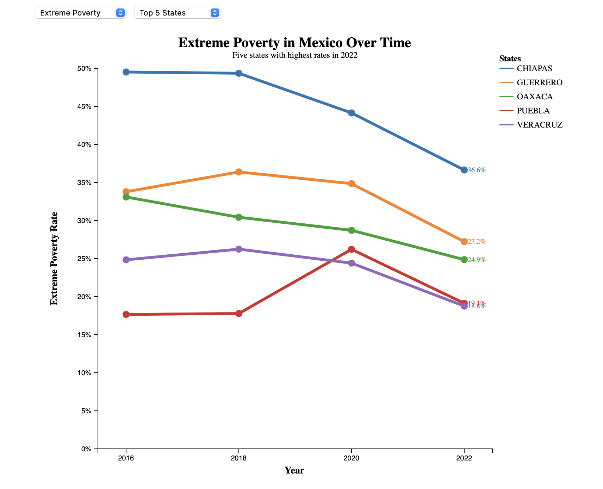

# Poverty in Mexico - Interactive Visualizations 📊

website: https://poverty-mexico-danielmb.netlify.app

## Summary:

Used JavaScript, html and D3 to create interactive visualizations about extreme poverty and alimentary poverty in Mexico. The visualizations include three visualizations

### Choropleth Map 🇲🇽

Option to change year, design to hihglight the selected state, and a tooltip that displays more information about the selected state.

### Bubbles plot 

Scroll effect that shows the difference in extreme poverty for every state; the first scroll renders orange points (2016 extreme poverty rate), the second scroll renders blue points (2022 extreme poverty rate), and the final scroll renders green/red lines to show the difference between 2016 and 2022.

### Lines Plot

Option to choose Extreme Poverty or Alimentary Poverty and another option to show the 5 states with the highest rates in 2022 or choose your own 5 states. It also has two hover effects: if you mouseover the line it will increase the stroke width and the size of the label, if you mouseover a point it will show a tooltip with the name of the state and the poverty rate for that year.

## Data

CONEVAL (Mexican Institution that measures poverty): https://www.coneval.org.mx/Medicion/MP/Paginas/Pobreza_2022.aspx

GeoJson Mexico: https://github.com/strotgen/mexico-leaflet/blob/master/states.geojson?short_path=40d4663

